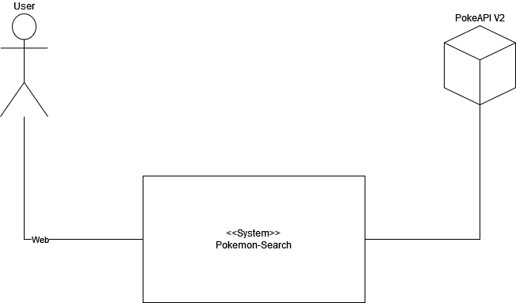
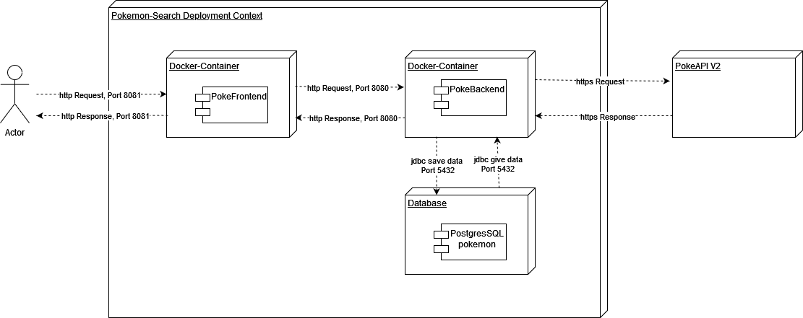
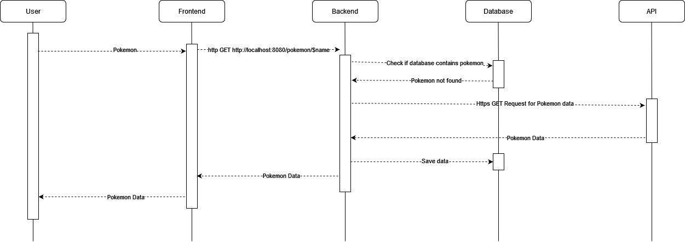
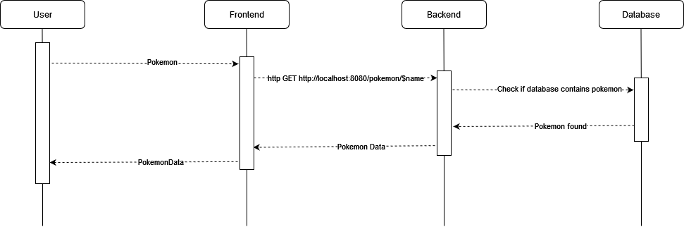
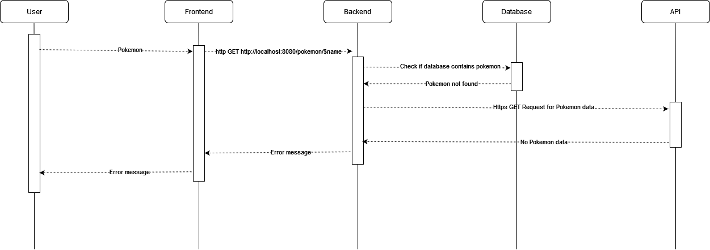
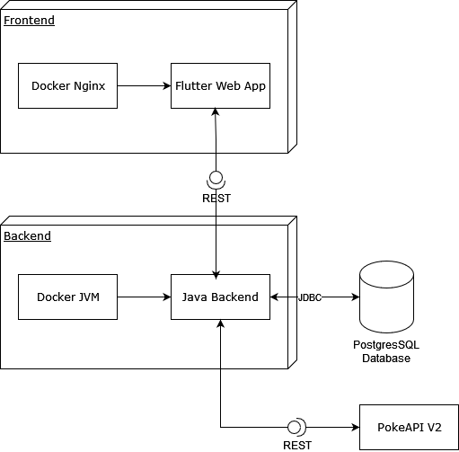
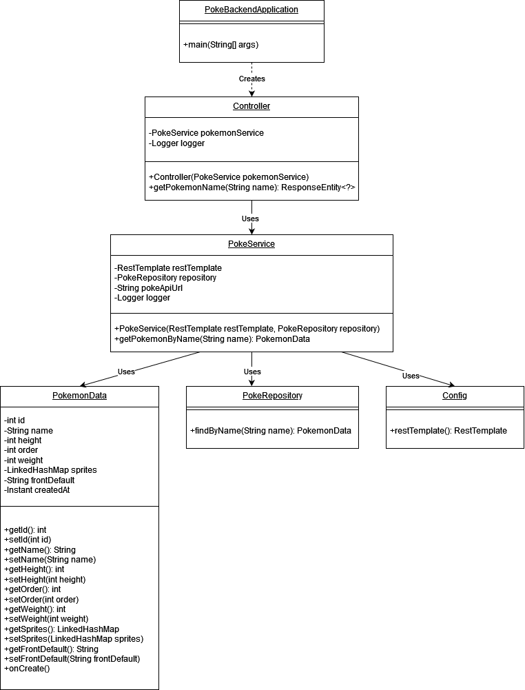
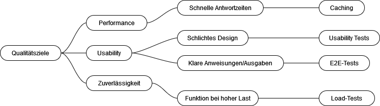

# PokeSearch

## Einführung und Ziele

Das Ziel von PokeSearch besteht darin, eine intuitive Plattform für Leute bereitzustellen, die sich über Pokémons informieren wollen. Hierfür sollen die Nutzer den Namen eines Pokémons suchen und die gewünschten Informationen erhalten.

Wichtige features sind heirbei die folgenden:
-   **Suchfunktion**: Benutzer können über eine Suchleiste nach Pokémon-Namen suchen.
-   **Benutzeroberfläche**: Eine benutzerfreundliche Oberfläche, die mit Flutter entwickelt wurde und eine barrierefreie Nutzung auf verschiedenen Geräten gewährleistet.
-   **Informationsabruf**: Detaillierte Informationen über das Pokémon, einschließlich Bild, Typ, Fähigkeiten und Statistiken, werden von der PokeAPI v2 abgerufen.

Die wesentlichen Anforderung an das Projekt setzen sich wiefolgt zusammen:
-   **REST API-Integration**: Das Backend muss effizient mit der PokeAPI v2 kommunizieren, um Pokémon-Daten abzurufen und zurückzugeben.
-   **Suchfunktion**: Das System muss es Benutzern ermöglichen, einen Pokémon-Namen einzugeben und relevante Informationen abzurufen.
-   **Datenanzeige**: Das Frontend muss das Bild und die Details des Pokémon klar und übersichtlich darstellen.

Für ein funktionales System, wird die Architektur mit folgenden Aspekten berücksichtigend entworfen:
-   **Performance**: Die Anwendung muss schnelle Antwortzeiten bieten, um die Benutzerzufriedenheit zu erhöhen.
-   **Benutzerfreundlichkeit**: Die Schnittstelle sollte intuitiv und zugänglich sein, um ein positives Benutzererlebnis zu gewährleisten.
-   **Zuverlässigkeit**: Das Programm soll konstant funktionieren und bei , sowohl bei internen Fehlern oder Fehlbdeienung durch den User 

In den Lebenszyklus der Software, sind folgende Stakeholder eingebunden, mit ihren jeweiligen Erwartungen:
-   **Endnutzer**: Pokémon-Fans, die eine zuverlässige, schnelle und benutzerfreundliche Anwendung erwarten, um Pokémon-Informationen zu suchen und anzuzeigen.
-   **Entwickler**: Das Entwicklungsteam, das für den Aufbau und die Wartung der Anwendung verantwortlich ist, und eine wartbare und gut dokumentierte Codebasis benötigt.
-   **API-Anbieter**: Das Team hinter der PokeAPI, das eine verantwortungsvolle und effiziente Nutzung ihres Dienstes erwartet.

### Aufgabenstellung

Es soll ein Microservice entwickelt werden, welcher an eine externe API und eine Datenbank angebunden ist. Zudem soll die Anwendung durch Automatisierung, durch Unit und Integration Tests und weitere Features erweitert werden, welche die jeweiligen Qualitätsziele erfüllen.

### Qualitätsziele {#_qualit_tsziele}

| Qualitätsziel   | Beschreibung                                                                                       | Szenario                                                                                                   | Umsetzung |
|-----------------|---------------------------------------------------------------------------------------------------|------------------------------------------------------------------------------------------------------------|-----------|
| **Performance** | Das System muss in der Lage sein, eine hohe Anzahl von Transaktionen in kurzer Zeit zu verarbeiten.  | Das System muss unter hoher Last weiterhin schnell und effizient arbeiten, um die Nutzerzufriedenheit zu gewährleisten. | Die Performance wird durch die Einbindung einer PostgreSQL-Datenbank ermöglicht. Durch das Caching der Pokémon-Daten können bereits gesuchte Pokémon erneut schneller abgerufen werden. Zudem wurden Lasttests mittels Artillery durchgeführt. |
| **Usability**   | Das System muss einfach und intuitiv bedienbar sein, auch für Benutzer ohne technische Vorkenntnisse. | Das System sollte durch ein benutzerfreundliches Design und klare Anweisungen eine intuitive Bedienung ermöglichen. | Die Sucheingabe ist simpel und minimalistisch gehalten, um Misverständnisse und Verwirrung zu vermeiden. |
| **Zuverlässigkeit** | Das System muss eine hohe Verfügbarkeit und Fehlertoleranz aufweisen.                             | Das System sollte in der Lage sein, Ausfälle zu minimieren und schnell wieder funktionsfähig zu sein, um kontinuierlichen Betrieb zu gewährleisten.| Für die Zuverässigkeit wurden Lasttests mittels Artillery und diverese Nutzungs-Szenarien in end-to-end Tests implementiert. |

### Stakeholder

| Rolle                 | Kontakt          | Erwartungshaltung                                                                 |
|-----------------------|------------------|----------------------------------------------------------------------------------|
| Endnutzer           | - | Zuverlässige, schnelle und benutzerfreundliche Anwendung, um Pokémon-Informationen zu suchen und anzuzeigen. |
| Entwickler            | katharina.winnen@stud.th-rosenheim.de | Wartbare und gut dokumentierte Codebasis, die fortlaufende Entwicklung und Wartung erleichtert. |
| API-Anbieter          | https://pokeapi.co/about | Verantwortungsvolle und effiziente Nutzung ihres Dienstes.                        |

## Randbedingungen

| Randbedingung                  | Beschreibung                                                                                                       |
|--------------------------------|-------------------------------------------------------------------------------------------------------------------|
| **Projektname**                | PokeSearch                                                                                                         |
| **Backend**          |  Das Backend fragt für Pokémon-Daten die PokeAPI v2 ab oder nutzt die PostgreSQL-Datenbank, wenn die Daten bereits gecacht wurden. |
| **Frontend**         | Das Frontend stellt die Suchfunktion mittels einer Suchleiste (Searchbar) dar und leitet den Nutzer nach einer erfolgreichen Suche auf eine Ergebnisseite weiter. |
| **Containerisierung**          | Frontend und Backend sind dockerisiert                                                                             |
| **Tests Backend**              | Lasttests und Unittests wurden für das Backend durchgeführt                                                        |
| **Tests Frontend**             | End-to-End (E2E) Tests wurden für das Frontend durchgeführt                                                        |
| **Pipeline**                   | Das Bauen des Frontend, des Backend und der Datenbankanbindung werden mittels einer Pipeline automatisiert. Zudem sind die Tests unter anderem statische Codeanalyse, Lasttests und E2E-Tests mit mehreren Szenarien enthalten. |

## Kontextabgrenzung

### Fachlicher Kontext

| Kommunikationsbeziehung | Eingabe           | Ausgabe           |
|-------------------------|-------------------|-------------------|
| Benutzer → Frontend     | Pokémon-Name      | Pokémon-Daten     |
| Frontend → Backend      | HTTP GET Anfrage  | JSON mit Pokémon-Daten |
| Backend → Externe API   | Pokémon-Name      | JSON mit Pokémon-Daten |

### Technischer Kontext

| Technischer Kanal | Eingabe           | Ausgabe           |
|-------------------------|-------------------|-------------------|
| Benutzer → dockerisiertes Frontend     | Pokémon-Name      | Pokémon-Daten     |
| dockerisiertes Frontend → dockerisiertes Backend     | HTTP GET Anfrage  | JSON mit Pokémon-Daten |
| dockerisiertes Backend → Externe API   | Pokémon-Name      | JSON mit Pokémon-Daten |
| dockerisiertes Backend → PostgresSQL pokemon   | Pokémon-Name      | JSON mit Pokémon-Daten |

#### Funktionalität des Backends:

Das Backend-System für die Pokémon-Abfrage hat verschiedene Aufgaben, die in unterschiedlichen Klassen organisiert sind. Beim Start wird die Spring Boot-Anwendung durch die `PokeBackendApplication`-Klasse initialisiert.

Der `Controller` ist für die Verarbeitung von HTTP GET-Anfragen zuständig. Er bietet den Endpunkt `/pokemon/{name}` an, über den der Benutzer Pokémon-Daten abrufen kann. Anfragen an diesen Endpunkt werden an den `PokeService` weitergeleitet.

Der `PokeService` enthält die Geschäftslogik des Systems. Er prüft, ob die angeforderten Pokémon-Daten in der Datenbank vorhanden sind. Wenn dies nicht der Fall ist, sendet er eine Anfrage an die externe PokeAPI, um die Daten zu erhalten. Diese neuen Daten werden anschließend in der Datenbank gespeichert und an den `Controller` zurückgegeben.

Der Zugriff auf die Datenbank erfolgt über die `PokeRepository`-Schnittstelle, die CRUD-Operationen (Create, Read, Update, Delete) auf der `PokemonData`-Entität durchführt. Die `PokemonData`-Klasse definiert die Struktur der gespeicherten Pokémon-Daten und enthält Felder wie `id`, `name`, `height`, `order`, `weight`, `sprites`, `frontDefault` und `createdAt`.

Externe API-Anfragen werden mit `RestTemplate` gesendet, welches in der `Config`-Klasse konfiguriert und als Bean bereitgestellt wird.

#### Schnittstellen:

##### HTTP-Endpunkte:
- **GET /pokemon/{name}**:
  - Diese Schnittstelle ermöglicht es, die Daten eines Pokémon basierend auf seinem Namen abzurufen.
  - **Eingabe**: Pokémon-Name (als Pfadparameter)
  - **Ausgabe**: Pokémon-Daten im JSON-Format

##### Interne Schnittstellen:
- **PokeService**:
  - **Methode**: `getPokemonByName(String name)`
    - **Eingabe**: Pokémon-Name (String)
    - **Ausgabe**: `PokemonData`-Objekt
- **PokeRepository**:
  - **Methode**: `findByName(String name)`
    - **Eingabe**: Pokémon-Name (String)
    - **Ausgabe**: `PokemonData`-Objekt oder `null`, wenn das Pokémon nicht vorhanden ist

##### Externe Schnittstellen:
- **PokeAPI**:
  - **URL**: `https://pokeapi.co/api/v2/pokemon/{name}`
  - **Methode**: `GET`
  - **Eingabe**: Pokémon-Name (als Pfadparameter)
  - **Ausgabe**: Pokémon-Daten im JSON-Format

## Lösungsstrategie

### Technologieentscheidungen
Für das Backend wurde Spring Boot als Framework ausgewählt. Spring Boot bietet eine breite Palette an Features, die die Entwicklung von robusten und skalierbaren Anwendungen unterstützen. Es integriert sich nahtlos mit Container-Technologien wie Docker und ist ideal für Microservice-Architekturen geeignet, was den Anforderungen an Performance und Skalierbarkeit gerecht wird. Flutter wurde als Frontend-Framework gewählt, da es eine leistungsfähige Plattform für die Entwicklung moderner, reaktionsschneller Benutzeroberflächen bietet und eine konsistente Benutzererfahrung über verschiedene Geräte hinweg ermöglicht. PostgreSQL dient als Datenbank und wurde aufgrund seiner Zuverlässigkeit, Leistungsfähigkeit und Erweiterbarkeit ausgewählt. Die Datenbank wird als Cache für die Daten der externen PokeAPI genutzt. Zur Beschaffung von Pokémon-Informationen wird die PokeAPI v2 verwendet, da sie eine umfassende Datenquelle für die benötigten Informationen bietet.

### Top-Level-Zerlegung
Das System folgt einer Client-Server-Architektur, bei der das Frontend und das Backend lose gekoppelt sind und jeweils spezifische Funktionalitäten bereitstellen. Diese Architektur ermöglicht eine einfachere Wartung, Skalierung und Weiterentwicklung der einzelnen Komponenten. Zudem werden sowohl das Frontend als auch das Backend als Docker-Container bereitgestellt, was isolierte Laufzeitumgebungen und Plattformunabhängigkeit sicherstellt und die Bereitstellung und Skalierung mithilfe von Docker-Compose erleichtert.

### Qualitätsanforderungen
Das PokeSearch-System wurde entwickelt, um den Anforderungen an Performance, Usability und Zuverlässigkeit gerecht zu werden

Um eine hohe Anzahl von Transaktionen in kurzer Zeit verarbeiten zu können, wurde eine PostgreSQL-Datenbank integriert. Diese ermöglicht es, durch das Caching der Pokémon-Daten bereits gesuchte Pokémon erneut schneller abzurufen. Zusätzlich wurden Lasttests mittels Artillery durchgeführt, um sicherzustellen, dass das System auch unter hoher Last schnell und effizient arbeitet. Diese Maßnahmen gewährleisten, dass das System selbst bei hoher Nutzerlast performant bleibt und die Zufriedenheit der Benutzer sichergestellt ist.

Ein weiteres zentrales Qualitätsziel ist die Benutzerfreundlichkeit. Das System muss einfach und intuitiv bedienbar sein, auch für Benutzer ohne technische Vorkenntnisse. Die Sucheingabe wurde daher simpel und minimalistisch gestaltet, um Missverständnisse und Verwirrung zu vermeiden. Die Benutzeroberfläche wurde mit Flutter entwickelt, um eine konsistente und reaktionsschnelle Benutzererfahrung auf verschiedenen Geräten zu gewährleisten. Um die Benutzerfreundlichkeit zu überprüfen, wurden End-to-End-Tests durchgeführt, die sicherstellen, dass die Anwendung intuitiv und leicht bedienbar ist.

Zuverlässigkeit ist ein weiterer kritischer Aspekt des Systems. Es ist essentiell, dass das System eine hohe Verfügbarkeit und Fehlertoleranz aufweist. Um dies zu erreichen, wurden umfangreiche Lasttests mit Artillery sowie diverse Nutzungsszenarien in End-to-End-Tests implementiert. Diese Tests stellen sicher, dass das System stabil und fehlerfrei läuft, selbst bei unerwarteten Eingaben und hoher Last. Die Containerisierung mittels Docker sorgt zudem für isolierte Laufzeitumgebungen und erleichtert die Bereitstellung und Skalierung der Anwendung. Eine CI/CD-Pipeline mithilfe von GitHub Actions automatisiert den gesamten Prozess vom Code-Commit bis zur Bereitstellung. Diese Pipeline führt eine Reihe automatisierter Tests durch, einschließlich Unit-, Integrations- und End-to-End-Tests, und gewährleistet eine kontinuierliche Integration und Auslieferung neuer Funktionen. Nach erfolgreichem Bestehen aller Tests werden Docker-Container erstellt und in einer Registry gespeichert, sodass sie in verschiedene Umgebungen bereitgestellt werden können. Diese Maßnahmen stellen sicher, dass das System stabil und zuverlässig arbeitet und kontinuierlich verbessert wird.

Durch diese umfassenden Maßnahmen zur Sicherstellung von Performance, Usability und Zuverlässigkeit erfüllt das PokeSearch-System die hohen Anforderungen und bietet eine leistungsstarke, benutzerfreundliche und stabile Plattform für die Abfrage von Pokémon-Daten.

### organisatorische Entscheidungen
Ein wesentlicher Bestandteil der organisatorischen Entscheidungen in diesem Projekt ist die Implementierung einer CI/CD-Pipeline mithilfe von GitHub Actions, um für eine hohe Qualität und Zuverlässigkeit des Codes zu sorgen. Diese Pipeline automatisiert den gesamten Prozess vom Code-Commit bis zur Bereitstellung und gewährleistet eine kontinuierliche Integration und Auslieferung neuer Funktionen und Verbesserungen. Bei jedem Push oder Pull-Request wird der Code automatisch gebaut und durch eine Reihe automatisierter Tests, einschließlich Unit-, Integrations- und End-to-End-Tests, geprüft. Zusätzlich werden Frontend-Tests durchgeführt, um sicherzustellen, dass die Benutzeroberfläche den Erwartungen entspricht. ArchUnit-Tests werden im Backend verwendet, um die Einhaltung von Architekturregeln zu überprüfen. Die Dockerfiles werden in der Pipeline gelintet, um sicherzustellen, dass sie syntaktisch korrekt und effizient geschrieben sind. SonarCloud ergänzt als statisches Code-Analyse-Tool die Tests, um sicherzustellen, dass der Code den Qualitätsstandards entspricht. Nach erfolgreichem Bestehen aller Tests werden Docker-Container erstellt und in einer Registry gespeichert. Diese Container können dann in die verschiedenen Umgebungen mithilfe der Docker-Compose-Datei bereitgestellt werden. Um die Leistungsfähigkeit und Stabilität der Anwendung unter hoher Last zu gewährleisten, werden zudem automatisierte Lasttests durchgeführt.

## Bausteinsicht

### Whitebox Gesamtsystem

.png)

#### Context

| Name            | Verantwortung                                                                                      |
|-----------------|----------------------------------------------------------------------------------------------------|
| Pokémon Search  | - Bietet eine Plattform für Benutzer, um detaillierte Informationen über Pokémon zu suchen und anzuzeigen.   - Integriert Frontend, Backend und Datenbank, um eine nahtlose Benutzererfahrung zu gewährleisten.   - Nutzt die PokeAPI v2, um aktuelle Pokémon-Daten abzurufen und speichert diese in der Datenbank zur Wiederverwendung. |
| PokeAPI v2      | - Externe API, die detaillierte Informationen über Pokémon bereitstellt, einschließlich Bilder, Typen, Fähigkeiten und Statistiken.   - Dient als primäre Datenquelle für die Pokémon-Daten, die im System verwendet werden.   - Bietet Endpunkte für den Zugriff auf verschiedene Pokémon-Daten, die von der Anwendung abgerufen werden können. |

#### System

| Name       | Verantwortung                                                                                      |
|------------|----------------------------------------------------------------------------------------------------|
| Frontend   | - Stellt die Benutzeroberfläche bereit, ermöglicht die Suche nach Pokémon und zeigt die Ergebnisse an.   - Entwickelt mit Flutter für eine konsistente und reaktionsschnelle Benutzererfahrung.   - Enthält die Suchleiste und Ergebnisseite, die die Pokémon-Daten anzeigen. |
| Backend    | - Verarbeitet Anfragen vom Frontend, führt die Geschäftslogik aus und kommuniziert mit der Datenbank und externen APIs.   - Entwickelt mit Spring Boot, um eine robuste und skalierbare Serverlogik zu bieten.   - Beinhaltet Endpunkte zur Abfrage der Pokémon-Daten und speichert gecachte Daten in der Datenbank. |
| Datenbank  | - Speichert gecachte Pokémon-Daten, um wiederholte Anfragen effizienter zu bearbeiten.   - Verwendet PostgreSQL aufgrund seiner Zuverlässigkeit, Leistungsfähigkeit und Erweiterbarkeit. |

#### Backend

| Name                  | Verantwortung                                      |
|-----------------------|----------------------------------------------------|
| PokeBackendApplication| Startet die Spring Boot-Anwendung                  |
| Controller            | Verarbeitet HTTP-Anfragen und ruft PokeService auf |
| PokeService           | Führt die Geschäftslogik aus, kommuniziert mit der Datenbank und externen APIs |
| PokeRepository        | Schnittstelle zur Datenbank, führt CRUD-Operationen durch |
| PokemonData           | Entitätsklasse, die die Struktur der Pokémon-Daten definiert |
| Config                | Stellt Beans bereit, z.B. RestTemplate             |

#### Frontend

| Name               | Verantwortung                                                   |
|--------------------|-----------------------------------------------------------------|
| main.dart          | Startet die Flutter-Anwendung und zeigt die `PokemonSearch`-Seite |
| PokemonSearch      | Stellt die Suchleiste dar und verwaltet Eingabe und Navigation                       |
| PokemonResult      | StatelessWidget, zeigt die Ergebnisse der Pokémon-Suche an und ruft Daten vom Backend ab      |
| PokemonData        | Datenklasse, die die Struktur der empfangenen Pokémon-Daten definiert |

## Laufzeitsicht

### Szenario: Benutzer gibt Pokémon-Namen ein und erhält Daten von der API

- Benutzer gibt den Namen eines Pokémon in die Suchleiste ein und drückt den Suchbutton.
- Frontend sendet eine HTTP GET-Anfrage an das Backend mit dem eingegebenen Pokémon-Namen.
- Backend` prüft, ob die Daten des angeforderten Pokémon in der PostgreSQL-Datenbank vorhanden sind.
  - **Daten vorhanden**:
    - Pokémon-Daten werden aus der Datenbank abgerufen.
    - Daten werden an den Backend-Controller zurückgegeben.
  - **Daten nicht vorhanden**:
    - Backend sendet eine Anfrage an die externe PokeAPI v2.
    - PokeAPI v2 liefert die angeforderten Pokémon-Daten zurück.
    - Abgerufene Pokémon-Daten werden in der Datenbank gespeichert.
    - Daten werden an das Backend zurückgegeben.
- Backend sendet die Pokémon-Daten als HTTP-Antwort an das Frontend.
- Frontend zeigt die erhaltenen Pokémon-Daten dem Benutzer an.

### Szenario: Pokémon-Daten sind in der Datenbank gecacht

- Benutzer gibt den Namen eines Pokémon in die Suchleiste ein und drückt den Suchbutton.
- Frontend sendet eine HTTP GET-Anfrage an das Backend mit dem eingegebenen Pokémon-Namen.
- Backend empfängt die Anfrage und leitet sie an den `PokeService` weiter.
- Backend prüft, ob die Daten des angeforderten Pokémon in der PostgreSQL-Datenbank vorhanden sind.
  - **Daten vorhanden**:
    - Pokémon-Daten werden aus der Datenbank abgerufen.
- Backend sendet die Pokémon-Daten als HTTP-Antwort an das Frontend.
- Frontend zeigt die erhaltenen Pokémon-Daten dem Benutzer an.

### Szenario: API gibt keine Pokémon-Daten zurück und liefert stattdessen Fehlermeldungen

- Benutzer gibt den Namen eines Pokémon in die Suchleiste ein und drückt den Suchbutton.
- Frontend sendet eine HTTP GET-Anfrage an das Backend mit dem eingegebenen Pokémon-Namen.
- Backend empfängt die Anfrage und leitet sie an den `PokeService` weiter.
- `Backend` prüft, ob die Daten des angeforderten Pokémon in der PostgreSQL-Datenbank vorhanden sind.
  - **Daten nicht vorhanden**:
    -  PokeAPI v2 gibt keine Daten zurück und liefert stattdessen eine Fehlermeldung.
    - Backend fängt die Fehlermeldung ab und erstellt eine entsprechende Antwort.
    - Backend gibt eine Fehlermeldung an den Backend-Controller zurück.
- Backend sendet die Fehlermeldung als HTTP-Antwort an das Frontend.
- Frontend zeigt die erhaltene Fehlermeldung dem Benutzer an.

## Verteilungssicht

### Infrastruktur

Das Frontend und Backend wurden mittels Docker containerisiert, um eine konsistente und skalierbare Umgebung bereitzustellen.

#### Frontend (Flutter + NGINX)

Das Flutter-Frontend wird in einem Docker-Container betrieben, der NGINX als Webserver verwendet. NGINX ist für seine hohe Leistung und geringe Ressourcennutzung bekannt, was die schnelle Auslieferung von statischen Inhalten ermöglicht. Der NGINX-Server läuft auf Port 80, wodurch das Frontend einfach über den Standard-HTTP-Port zugänglich ist.

#### Backend (Spring Boot + JVM)

Das Backend, entwickelt mit Spring Boot, läuft in einem JVM-basierten Docker-Container. Spring Boot wurde aufgrund seiner umfangreichen Features und seiner Eignung für die Entwicklung robuster und skalierbarer Anwendungen ausgewählt. Der Backend-Server läuft auf Port 8080, was ein gängiger Standardport für Webanwendungen ist.

#### Docker Compose

Docker Compose wird verwendet, um die Konfiguration und Orchestrierung der verschiedenen Docker-Container zu verwalten. Mit Docker Compose kann das gesamte System, bestehend aus Frontend, Backend und weiteren Diensten, mit einem einzigen Befehl gestartet werden. Dies stellt sicher, dass alle Container in einer einheitlichen und kontrollierten Umgebung laufen.

#### Vorteile der Entscheidungen

- **Konsistenz und Skalierbarkeit**: Durch die Containerisierung mit Docker wird eine konsistente Laufzeitumgebung sichergestellt, was die Skalierbarkeit und Verwaltung der Anwendung erleichtert.
- **Leistungsfähigkeit**: NGINX ermöglicht eine schnelle und effiziente Auslieferung des Frontends, während Spring Boot die robusten und skalierbaren Backend-Dienste bereitstellt.
- **Einfache Orchestrierung**: Docker Compose ermöglicht eine einfache Verwaltung und Orchestrierung aller Container, was den Entwicklungs- und Bereitstellungsprozess erheblich vereinfacht.

## Querschnittliche Konzepte

## Architekturentscheidungen

### Flutter
Flutter wurde gewählt, weil es eine leistungsfähige Plattform für die Entwicklung moderner, reaktionsschneller Benutzeroberflächen bietet und eine konsistente Benutzererfahrung über verschiedene Geräte hinweg ermöglicht.

### Spring Boot
Spring Boot wurde aufgrund seiner umfangreichen Features und seiner Eignung für die Entwicklung robuster und skalierbarer Anwendungen ausgewählt. Es bietet eine nahtlose Integration mit Container-Technologien wie Docker.

### SonarCloud
SonarCloud wurde integriert, um die Qualität des Codes kontinuierlich zu überwachen und sicherzustellen, dass der Code den höchsten Standards entspricht. Es bietet umfassende statische Code-Analysen und hilft, potenzielle Probleme frühzeitig zu erkennen.

### JUnit
JUnit wurde als Testframework gewählt, um die Entwicklung und Durchführung von Unit-Tests zu erleichtern. Es unterstützt die Sicherstellung der Codequalität und der Funktionalität durch automatisierte Tests.

### Artillery
Artillery wurde für Lasttests verwendet, um die Performance des Systems unter hoher Last zu prüfen und sicherzustellen, dass die Anwendung den Anforderungen an die Skalierbarkeit gerecht wird.

### PostgreSQL
PostgreSQL wurde aufgrund seiner Zuverlässigkeit, Leistungsfähigkeit und Erweiterbarkeit als Datenbank ausgewählt. Es dient als Speichersystem für gecachte Pokémon-Daten, um die Effizienz der Datenabfragen zu erhöhen.

### Hadolint
Hadolint wurde integriert, um die Dockerfiles zu linten und sicherzustellen, dass sie syntaktisch korrekt und effizient geschrieben sind. Es hilft, Best Practices für Docker-Container zu gewährleisten.

### Docker
Docker wurde gewählt, um eine konsistente und isolierte Laufzeitumgebung für die Anwendung bereitzustellen. Es erleichtert die Bereitstellung und Skalierung der Anwendung auf verschiedenen Plattformen.

### GitHub Actions
GitHub Actions wurde für die Implementierung einer CI/CD-Pipeline verwendet. Es automatisiert den gesamten Prozess vom Code-Commit bis zur Bereitstellung, einschließlich der Durchführung von Tests und der Bereitstellung von Docker-Containern.

### Docker Compose
Docker Compose wurde verwendet, um die Konfiguration und Orchestrierung der verschiedenen Docker-Container zu verwalten. Es ermöglicht das einfache Starten und Verwalten aller Container mit einem einzigen Befehl.

### Flutter integration_test
Die `integration_test`-Bibliothek von Flutter wurde gewählt, um End-to-End-Tests für das Flutter-Frontend durchzuführen. Diese Bibliothek ermöglicht es, das gesamte System zu testen, einschließlich der Benutzeroberfläche und der Interaktion mit dem Backend, um sicherzustellen, dass alle Komponenten nahtlos zusammenarbeiten und eine optimale Benutzererfahrung bieten.

### Backend
| Tool                  | Version              |
|--------------------------------------|----------------------|
| Java                                 | 17                   |
| Spring Boot                          | 3.2.4                |
| Gradle        | 8.8               |

### Frontend
| Tool                  | Version              |
|--------------------------------------|----------------------|
| Flutter                                | 3.22.2                  |

### Tests
| Tool                  | Version              |
|--------------------------------------|----------------------|
| JUnit                              | 5                  |
| Artillery                          | latest               |

## Qualitätsanforderungen

### Qualitätsbaum

### Qualitätsszenarien

# Qualitätsziele und Maßnahmen

| Attribut       | Szenario                                                                                               | Maßnahme                                      |
|----------------|--------------------------------------------------------------------------------------------------------|-----------------------------------------------|
| **Usability**  | Nutzungsszenario: Benutzer können intuitiv nach Pokémon suchen und die Ergebnisse anzeigen lassen.      | Benutzerfreundliches UI-Design, einfache Navigation, End-to-End-Tests mit Flutter integration_test |
|                | Änderungsszenario: Verbesserungen in der Benutzeroberfläche werden kontinuierlich umgesetzt.            | Benutzerfeedback einholen und umsetzen, UI-Tests |
|                | Nutzungsszenario: Das System zeigt relevante Informationen zu Pokémon klar und verständlich an.         | Übersichtliches Layout, konsistente Darstellung der Daten |
|                | Änderungsszenario: Neue Nutzeranforderungen an das Design werden kontinuierlich integriert.              | Regelmäßige Überprüfung und Anpassung an Nutzeranforderungen |
| **Performance**| Nutzungsszenario: Das System muss unter hoher Last schnell und effizient arbeiten.                      | Lasttests mit Artillery                       |
|                | Änderungsszenario: Anpassung der Systemkonfiguration zur Verbesserung der Leistung.                      | Performance-Optimierungen und erneute Lasttests |
|                | Nutzungsszenario: Das System soll auch bei vielen gleichzeitigen Anfragen stabil bleiben.                | Caching von Daten mit PostgreSQL              |
|                | Änderungsszenario: Änderungen im Code oder neue Funktionen erfordern erneute Performance-Tests.          | Wiederholte Performance-Tests                 |
| **Reliability**| Nutzungsszenario: Um die Zuverlässigkeit zu gewährleisten, wird das System umfassend getestet.           | Unit-Tests, Integrationstests, End-to-End-Tests, Lasttests |
|                | Änderungsszenario: Regelmäßige Aktualisierung des Testkonzepts bei einer Änderung im Code.               | Umfassende Testabdeckung                      |
|                | Nutzungsszenario: Das System bleibt unter hoher Last stabil und reagiert effizient.                      | Lasttests mit Artillery                       |
|                | Änderungsszenario: Neue Anforderungen erfordern Anpassungen und erneute Tests der Systemstabilität.      | Anpassung der Tests                           |

## Risiken und technische Schulden

# Technische Schulden und Maßnahmen

| Risiko/Technische Schuld                        | Beschreibung                                                                                           | Maßnahme zur Risikovermeidung/Risikominimierung/Abbau der technischen Schuld | Priorität |
|-------------------------------------------------|-------------------------------------------------------------------------------------------------------|------------------------------------------------------------------------------|-----------|
| Durchlauf der Pipeline        | Pipeline läuft aktuell nicht durch. | Richten der Pipeline. | Hoch      |
| Umgang mit sensiblen Daten                      | Es muss sichergestellt werden, dass sensible Daten sicher gehandhabt werden, idealerweise mit Umgebungsvariablen. | Nutzung von Umgebungsvariablen für alle sensiblen Daten, Einführung von Sicherheitsrichtlinien und regelmäßigen Überprüfungen | Hoch      |
| Keine Integrationstests für das Backend         | Es fehlen Integrationstests für das Backend, was zu unerkannten Fehlern bei der Interaktion der Komponenten führen kann. | Einführung und Implementierung von Integrationstests für das Backend | Hoch      |
| Keine Unit-Tests für das Frontend               | Es fehlen Unit-Tests für das Frontend, was zu einer geringeren Testabdeckung und möglichen Fehlern führen kann. | Einführung und Implementierung von Unit-Tests für das Frontend | Mittel     |
| Abhängigkeit von externer API                   | Das System ist stark von der Verfügbarkeit und Zuverlässigkeit der externen PokeAPI abhängig.         | Einführung von Caching-Mechanismen, Implementierung von Fallback-Strategien und regelmäßigen Verfügbarkeitsprüfungen der API | Hoch      |

## Glossar

# Glossar

| Begriff         | Definition                                                                                           |
|-----------------|------------------------------------------------------------------------------------------------------------|
| API             | Application Programming Interface, eine Schnittstelle, die es ermöglicht, dass verschiedene Softwareanwendungen miteinander kommunizieren. |
| Artillery       | Ein Lasttest-Tool, das verwendet wird, um die Performance von Systemen unter hoher Last zu testen.         |
| Caching         | Eine Technik zur Speicherung häufig abgerufener Daten, um die Antwortzeiten zu verkürzen und die Leistung zu verbessern. |
| CI/CD Pipeline  | Continuous Integration/Continuous Deployment Pipeline, die den Prozess der Integration und Bereitstellung von Code automatisiert. |
| Docker          | Eine Plattform zur Containerisierung von Anwendungen, die es ermöglicht, Software in isolierten Umgebungen auszuführen. |
| Docker Compose  | Ein Werkzeug zur Definition und Ausführung mehrerer Docker-Container, die zusammen eine Anwendung bilden.   |
| End-to-End Test (E2E Test) | Ein Test, der die gesamte Anwendung von Anfang bis Ende überprüft, um sicherzustellen, dass alle Komponenten zusammenarbeiten. |
| Flutter         | Ein UI-Toolkit von Google zur Entwicklung nativ kompilierter Anwendungen für Mobilgeräte, Web und Desktop aus einer einzigen Codebasis. |
| GitHub Actions  | Ein CI/CD-Tool, das in GitHub integriert ist und automatisierte Workflows für den Softwareentwicklungsprozess ermöglicht. |
| Hadolint        | Ein Linter für Dockerfiles, der sicherstellt, dass sie syntaktisch korrekt und effizient geschrieben sind.  |
| JUnit           | Ein Testframework für Java, das die Entwicklung und Durchführung von Unit-Tests erleichtert.                |
| Load Test       | Ein Test, der die Performance eines Systems unter einer bestimmten Last prüft, um sicherzustellen, dass es effizient arbeitet. |
| PostgreSQL      | Ein leistungsfähiges, objektrelationales Datenbankmanagementsystem, das für seine Zuverlässigkeit und Erweiterbarkeit bekannt ist. |
| PokeAPI v2      | Eine externe API, die detaillierte Informationen über Pokémon bereitstellt, einschließlich Bilder, Typen, Fähigkeiten und Statistiken. |
| SonarCloud      | Ein Tool zur statischen Code-Analyse, das die Codequalität überwacht und sicherstellt, dass der Code den höchsten Standards entspricht. |
| Spring Boot     | Ein Framework für die Entwicklung robuster und skalierbarer Java-Anwendungen, das eine schnelle Entwicklung und einfache Konfiguration ermöglicht. |
| Unit Test       | Ein Test, der einzelne Komponenten oder Funktionen einer Anwendung isoliert überprüft, um deren korrekte Funktionalität sicherzustellen. |

